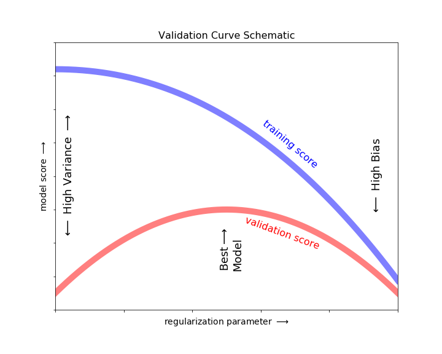
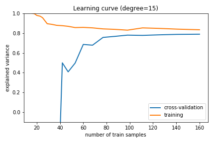

# Evaluating a Machine Learning Algorithm
> ### A TOOL BOX - ‘WHAT TO TRY NEXT?’

## Overview
With abundance of easy-to-use ML Libraries available, it is often appealing to apply them and achieve greater than 80% prediction accuracy in most cases. But, **‘WHAT TO TRY NEXT?’** is a question that buzz me, and may be other aspiring Data Scientists, a lot.
<br />
<br />
During my course **‘Machine Learning – Stanford Online’** at Coursera, **Prof. Andrew Ng** helped me sail through it. I hope this article, which briefs his explanation during one of his lectures, will help many of us to understand the importance of ‘debugging or diagnosing a learning algorithm’.
<br />
<br />

To start with, let’s call out all the possibilities or **‘WHAT TO TRY NEXT?’** when a hypothesis makes unacceptably large errors in its predictions or when there is a need to improve our hypothesis:


| No. |   **‘WHAT TO TRY NEXT?’**                      |
|---  | :----------------------------------------------|
| 1.  | Try Smaller Set of Features                    |
| 2.  | Add New Features                               |
| 3.  | Add Polynomial Features                        |
| 4.  | Decrease Regularization Parameter              |
| 5.  | Increase Regularization Parameter              |
| 6.  | Get More Training Examples                     |


_<p align="right"> We will revisit this table to make smart choices and create our **TOOL BOX**. </p>_

The above-mentioned diagnosis will basically help to find a **Bias Variance Trade Off**.  
Let’s visualize this concept briefly with a simple figure to illustrate the _overfitting_ (High Variance) and _underfitting_ (High Bias). 

<br />
<br />

## The Bias Variance Trade Off

_Fundamentally, the question of "the best model" is about finding a sweet spot in the tradeoff between bias and variance._
<br />
Here is a link to [The Bias Variance Trade Off](https://jakevdp.github.io/PythonDataScienceHandbook/05.03-hyperparameters-and-model-validation.html#The-Bias-variance-trade-off) explained beautifully by Jake VanderPlas in Python Data Science Handbook.

Following code visualizes over different _degrees of polynomial_.  
Please note that _overfitting_ and _underfitting_ can occur over different _regularization parameter_ and _training set size_.
> Source Code: [Scipy Lecture Notes](https://scipy-lectures.org/packages/scikit-learn/auto_examples/plot_bias_variance.html#bias-and-variance-of-polynomial-fit)

```
%matplotlib inline
import numpy as np
import matplotlib.pyplot as plt

def generating_func(x, err=0.5):
    return np.random.normal(10 - 1. / (x + 0.1), err)

from sklearn.pipeline import make_pipeline
from sklearn.linear_model import LinearRegression
from sklearn.preprocessing import PolynomialFeatures

n_samples = 8

np.random.seed(0)
x = 10 ** np.linspace(-2, 0, n_samples)
y = generating_func(x)

x_test = np.linspace(-0.2, 1.2, 1000)

titles = ['d = 1 (under-fit; high bias)',
          'd = 2',
          'd = 6 (over-fit; high variance)']
degrees = [1, 2, 6]

fig = plt.figure(figsize=(9, 3.5))
fig.subplots_adjust(left=0.06, right=0.98, bottom=0.15, top=0.85, wspace=0.05)

for i, d in enumerate(degrees):
    ax = fig.add_subplot(131 + i, xticks=[], yticks=[])
    ax.scatter(x, y, marker='x', c='k', s=50)

    model = make_pipeline(PolynomialFeatures(d), LinearRegression())
    model.fit(x[:, np.newaxis], y)
    ax.plot(x_test, model.predict(x_test[:, np.newaxis]), '-b')

    ax.set_xlim(-0.2, 1.2)
    ax.set_ylim(0, 12)
    ax.set_xlabel('house size')
    if i == 0:
        ax.set_ylabel('price')

    ax.set_title(titles[i])
```

 </img>

<br />
<br />

## Validation Curves

### 1. Varying Model Complexity

> Source Code: [Scipy Lecture Notes](https://scipy-lectures.org/packages/scikit-learn/auto_examples/plot_bias_variance.html#bias-and-variance-of-polynomial-fit)

Generate a larger dataset

```
from sklearn.model_selection import train_test_split

n_samples = 200
test_size = 0.4
error = 1.0

# randomly sample the data
np.random.seed(1)
x = np.random.random(n_samples)
y = generating_func(x, error)

# split into training, validation, and testing sets.
x_train, x_test, y_train, y_test = train_test_split(x, y, test_size=test_size)

# show the training and validation sets
plt.figure(figsize=(6, 4))
plt.scatter(x_train, y_train, color='red', label='Training set')
plt.scatter(x_test, y_test, color='blue', label='Test set')
plt.title('The data')
plt.legend(loc='best');
```

 </img>

Plot a validation curve for varying model complexity

```
from sklearn.model_selection import validation_curve

degrees = np.arange(1, 21)

model = make_pipeline(PolynomialFeatures(), LinearRegression())

# The parameter to vary is the "degrees" on the pipeline step
# "polynomialfeatures"
train_scores, validation_scores = validation_curve(
                 model, x[:, np.newaxis], y,
                 param_name='polynomialfeatures__degree',
                 param_range=degrees,
                 cv = 5)

# Plot the mean train error and validation error across folds
plt.figure(figsize=(6, 4))
plt.plot(degrees, validation_scores.mean(axis=1), lw=2,
         label='cross-validation')
plt.plot(degrees, train_scores.mean(axis=1), lw=2, label='training')

plt.legend(loc='best')
plt.xlabel('degree of fit')
plt.ylabel('explained variance')
plt.title('Validation curve')
plt.tight_layout()
```
 </img>

 </img>

Image Source: [Python Data Science Handbook by Jake VanderPlas](https://jakevdp.github.io/PythonDataScienceHandbook/05.03-hyperparameters-and-model-validation.html)


|No.|**‘WHAT TO TRY NEXT?’**          |**Results**               |**Fixes**      |
|-- |:--------------------------------|:-------------------------|:--------------|
|1. |Try Smaller Set of Features      |Decreases Model Complexity|_High Variance_|
|2. |Add New Features                 |Increases Model Complexity| _High Bias_   |
|3. |Add Polynomial Features          |Increases Model Complexity|_High Bias_    |
|4. |Decrease Regularization Parameter|                          |               |
|5. |Increase Regularization Parameter|                          |               |
|6. |Get More Training Examples       |                          |               |

<br />

### 2. Varying Regularization Parameter

>To generate a dataset and plot a validation curve for varying regularization parameter is NOT within the scope of this discussion. Still interested? Please refer [Python Data Science Handbook by Jake VanderPlas](https://jakevdp.github.io/PythonDataScienceHandbook/05.06-linear-regression.html#Regularization)

We know that, the introduction of basis functions (PolynomialFeatures, GaussianFeatures etc.) into our linear regression makes the model much more flexible.  

_<p align = "center"> But, does it come with the risk of something?
YES, and the answer is **overfitting** </p>_

**Reason**: Our model is being too flexible to capture the outliers or extreme values in our training dataset.  
**Solution**: Regularization

**Regularization** is a form of regression that penalizes or constrains or regularizes the model parameters towards zero.
* This works well when we have a lot of features, each of which contributes a bit to our prediction.
* So, we keep all the features, but reduce the magnitude or values of parameters.

 </img>

Image Source Code: [Python Data Science Handbook by Jake VanderPlas](https://jakevdp.github.io/PythonDataScienceHandbook/05.03-hyperparameters-and-model-validation.html)

|No.|**‘WHAT TO TRY NEXT?’**           |**Results**                 |**Fixes**      |
|-- |:---------------------------------|:---------------------------|---------------|
|1. |Try Smaller Set of Features       |Decreases Model Complexity  |_High Variance_|
|2. |Add New Features                  | Increases Model Complexity | _High Bias_   |
|3. |Add Polynomial Features           |Increases Model Complexity  |_High Bias_    |
|4. |Decrease Regularization Parameter |Decreases Penalty           |_High Bias_    |
|5. |Increase Regularization Parameter |Increases Penalty           |_High Variance_|
|6. |Get More Training Examples        |                            |               |

<br />
<br />

## Learning Curves

> Source Code: [Scipy Lecture Notes](https://scipy-lectures.org/packages/scikit-learn/auto_examples/plot_bias_variance.html#bias-and-variance-of-polynomial-fit)

Plot train and test error with an increasing number of samples for _FIXED MODEL COMPLEXITY_ (with d = 1 and d = 15)

```
# A learning curve for d = 1, 15
for d in [1, 15]:
    model = make_pipeline(PolynomialFeatures(degree=d), LinearRegression())

    from sklearn.model_selection import learning_curve
    train_sizes, train_scores, validation_scores = learning_curve(
        model, x[:, np.newaxis], y,
        train_sizes=np.logspace(-1, 0, 20),
        cv = 5)

    # Plot the mean train error and validation error across folds
    plt.figure(figsize=(6, 4))
    plt.plot(train_sizes, validation_scores.mean(axis=1),
            lw=2, label='cross-validation')
    plt.plot(train_sizes, train_scores.mean(axis=1),
                lw=2, label='training')
    plt.ylim(bottom=-.1, top=1)

    plt.legend(loc='best')
    plt.xlabel('number of train samples')
    plt.ylabel('explained variance')
    plt.title('Learning curve (degree=%i)' % d)
    plt.tight_layout()


plt.show()
```

 </img>

**For Fixed Model Complexity (d = 1) - A High-Bias Estimator:**
* It _underfits_ the data as both the training and validation scores are low, or the learning curves have converged to a low score.
* We can expect that adding more training data will not help
* Revisit _‘WHAT TO TRY NEXT?’_ table to fix _High Bias_

 </img>

**For Fixed Model Complexity (d = 15) - A High-Variance Estimator:**

* It _overfits_ the data as the training score is much higher than the validation score.
* As we add more samples to this training set:
    * the training score will continue to decrease, 
    * while the cross-validation score will continue to increase, until they meet in the middle.
* We can expect that adding more training data will help.

<br />
<br />

|No.|**‘WHAT TO TRY NEXT?’**           |**Results**                |**Fixes**      |
|-- |:---------------------------------|:--------------------------|:--------------|
|1. |Try Smaller Set of Features       |Decreases Model Complexity |_High Variance_|
|2. |Add New Features                  |Increases Model Complexity |_High Bias_    |
|3. |Add Polynomial Features           |Increases Model Complexity |_High Bias_    |
|4. |Decrease Regularization Parameter |Decreases Penalty          |_High Bias_    |
|5. |Increase Regularization Parameter |Increases Penalty          |_High Variance_|
|6. |Get More Training Examples        |Increases Sample Size      |_High Variance_|

<br />

_<p align = center> So as promised, here we have our **TOOL BOX - ‘WHAT TO TRY NEXT?’**  
    which, along with Validation and Learning Curves, will help us make smart decisions. </p>_

<br />

### References
* A lecture from **‘Machine Learning – Stanford Online’** at Coursera, by **Prof. Andrew Ng**
* [Python Data Science Handbook by Jake VanderPlas](https://jakevdp.github.io/PythonDataScienceHandbook/05.06-linear-regression.html)
* [Scipy Lecture Notes](https://scipy-lectures.org/packages/scikit-learn/index.html)